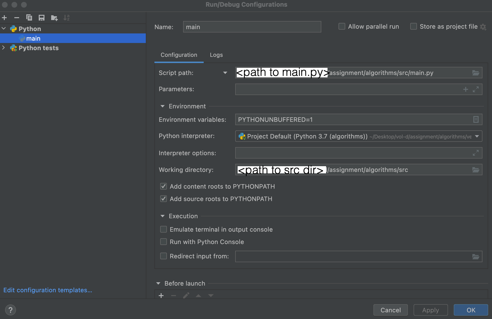
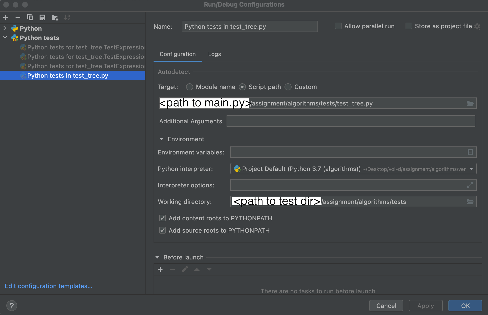

## Algorithms

### How to compile & run

1. Import this project in pycharm.
2. To Run application Add new config as below:

3. Execute application by clicking :arrow_forward:

### How to run tests
1. Import this project in pycharm.
2. To Run test Add new config as below:

3. Execute tests by clicking :arrow_forward:

Thanks!